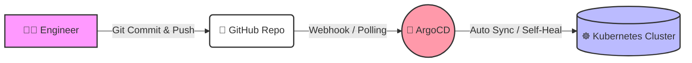

# ArgoCD & GitOps Setup Guide

> [!NOTE]
> Direktori ini berisi seluruh skrip dan konfigurasi deklaratif ( *Infrastructure as Code*) untuk menginstal **ArgoCD** serta mengimplementasikan arsitektur **GitOps** secara utuh di dalam cluster Kubernetes lokal Anda.

## 🎯 Arsitektur GitOps
Prinsip utama dari GitOps adalah menjadikan **Git Repository sebagai satu-satunya sumber kebenaran (Single Source of Truth)**. Anda tidak perlu lagi melakukan `kubectl apply` secara manual ke dalam server.



ArgoCD akan memonitor repositori secara terus-menerus. Jika ada ketidaksesuaian (*drift*) antara status di cluster dengan status di Git (misalnya ada peretas yang mengubah pod secara manual), ArgoCD akan langsung memulihkan statusnya berdasarkan Git (*Self-Healing*).

---

## 🚀 Tahap 1: Instalasi ArgoCD Server

Skrip `setup.sh` dirancang untuk menginstal ArgoCD secara efisien menggunakan metode instalasi `server-side` guna mencegah error keterbatasan ukuran anotasi CRD.

Buka terminal, masuk ke folder `argocd-setup`, dan eksekusi skrip berikut:

```bash
# 1. Jadikan script bisa dieksekusi (hanya diperlukan 1 kali)
chmod +x setup.sh

# 2. Jalankan instalasi otomatis
./setup.sh
```

> [!TIP]
> Skrip ini akan memakan waktu kurang lebih **1-2 menit** untuk menunggu hingga seluruh *Pod* ArgoCD berstatus `Running`. Anda tidak perlu melakukan tindakan apapun selama proses ini.

---

## 🔑 Tahap 2: Akses Dashboard (UI)

Skrip setup telah menebak-nebak dan mengonfigurasi jaringan untuk mengekspos UI ArgoCD secara otomatis melalui fitur **NodePort K3d** yang permanen dan stabil di port **31804**.

### Langkah Login:
1. **Dapatkan Password Admin Awal**: ArgoCD diinstal dengan password yang diacak secara aman. Jalankan perintah ini untuk melihat hasilnya:
   ```bash
   kubectl -n argocd get secret argocd-initial-admin-secret -o jsonpath="{.data.password}" | base64 -d; echo
   ```
   *(Username bawaan adalah `admin`)*.

2. **Buka Browser**: Kunjungi tautan berikut di Chrome atau Safari Anda:
   👉 **[https://localhost:31804](https://localhost:31804)**

> [!WARNING]
> Sangat wajar jika muncul peringatan "Connection is not private" / "Your connection is not private". Klik tombol **Advanced** lalu pilih **Proceed to localhost (unsafe)**. Ini terjadi karena sertifikat TLS digenerate secara lokal (*self-signed*).

---

## 📦 Tahap 3: Menerapkan Pola GitOps ke Aplikasi Kustomize Anda!

Setelah ArgoCD terinstal, kita perlu memerintahkannya untuk mulai mengawasi ( *watch*) repositori Kubernetes Manifest kita (`k8s-manifest`).

Proses pendaftaran repositori ini kita lakukan **secara deklaratif** menggunakan file bernama `argocd-application.yaml`. Proses ini sering disebut sebagai pola *App of Apps*.

### Cara Mengaktifkan Jembatan GitOps:
Pastikan Anda sudah berada di dalam folder `argocd-setup`, lalu jalankan:

```bash
kubectl apply -f argocd-application.yaml
```

**Apa isi dari `argocd-application.yaml`?**
File tersebut mendeklarasikan objek **Application** di ArgoCD yang berisi:
- `repoURL`: Merujuk ke repository Git Anda (`https://github.com/hegieswe/k8s-manifest.git`).
- `path`: Area spesifik di Git yang dibaca (contoh: `overlays/development`).
- `destination`: Tujuan penempatan di server Kubernetes (`test-project` pada localhost).
- `syncPolicy.automated`: 
  - `prune: true` (Menghapus pod di server jika filenya dihapus di Git).
  - `selfHeal: true` (Auto-merestore pod jika ada perubahan ilegal langsung di K8s).

### 🎉 Selamat!
Jika `argocd-application.yaml` telah berjalan, siklus rilis (*deployment*) Anda sekarang telah **100% full-otomatis**.

Mulai detik ini, **JANGAN** pernah melakukan `kubectl apply` secara manual untuk memodifikasi service Anda. **Cukup lakukan Git Commit dan Push!** ArgoCD akan secara instan (atau dalam batasan interval normal ~3 menit) menangkap Commit tersebut dan menyelaraskannya (*Sync*) ke dalam server secara otomatis.
